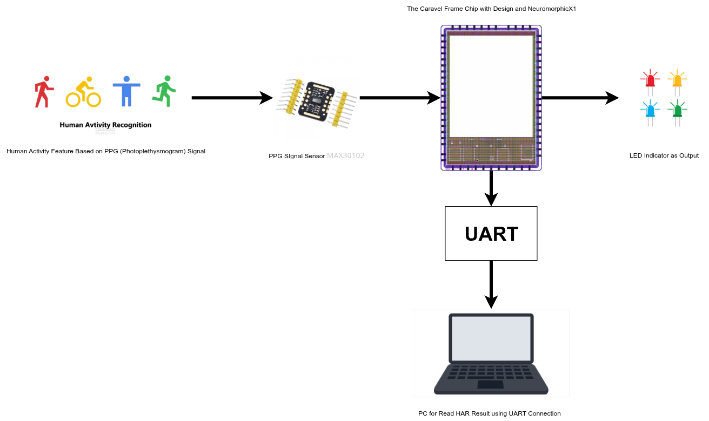

# Human Activity Recognition using Neuromorphic X1 with Spiking Neural Network Algorithm

This project reuses a previously developed neuromorphic hardware design that already integrates BM Labs’ non-volatile memory (NVM) IP. The NVM functions as synaptic weight storage for compute-in-memory (CIM) operations, enabling efficient in-memory processing that reduces data movement and power consumption.

By combining NVM-based CIM with the Neuromorphic X1 core, the design supports spiking neural network (SNN) processing for biomedical signal recognition. This integration ensures low-power operation, real-time activity classification, and seamless compatibility with the Caravel PicoRV interface and MAX30102 sensor input.

---

## Project Members

- Ahmad Jabar Ilmi — Institut Teknologi Sepuluh Nopember — [ilmiahmad983@gmail.com](mailto:ilmiahmad983@gmail.com)  
- Muhammad Shofuwan Anwar — National Taiwan University of Science and Technology — [muh.shofuwan.a@mail.ugm.ac.id](mailto:muh.shofuwan.a@mail.ugm.ac.id)  
- M. Taufiqul Huda — National Taiwan University of Science and Technology — [muhammadhuda1025@gmail.com](mailto:muhammadhuda1025@gmail.com)

---

## 1. Introduction
Recent advancements in neuromorphic hardware and biomedical sensing have opened new opportunities for edge-level intelligent systems. This project explores the integration of a spiking neural network (SNN)-based human activity recognition core within the Neuromorphic X1 framework, utilizing non-volatile memory (NVM) for efficient on-chip learning and inference.

The project aims to demonstrate a low-power, hardware-efficient design that supports real-time physiological data analysis from biomedical sensors.

---

## 2. Objectives
- Implement a hardware-based spiking neural network for human activity recognition.  
- Integrate the design with BM Labs’ Neuromorphic X1 IP.  
- Interface directly with the MAX30102 biomedical sensor for real-time data input.  
- Provide classification results through the Caravel PicoRV interface.  
- Ensure open-source reproducibility and compliance with the BM Labs challenge requirements.

---

## 3. System Overview
### 3.1 Architecture Diagram

Figure: High-level block diagram showing MAX30102 → spike encoder/preprocessor → SNN core with NVM-based synaptic storage (Neuromorphic X1) → Caravel PicoRV interface for classification outputs.

### 3.2 Data Flow Description
1. The MAX30102 sensor captures biomedical signals (e.g., heart rate, motion).  
2. The signal is pre-processed and converted into spike representations.  
3. The SNN core performs inference and classification.  
4. The results are output through the Caravel PicoRV interface for monitoring or logging or using LED indicator as output.

---

## 4. Spiking Neural Network Training.
The model (weight) training use snntorch to obtain the weight and bias of SNN crossbar. The code notebook is in here [Python Notebook SNN Training](training_snn)

## 4. Integration with BM Labs’ IP
This project reuses a previously developed neuromorphic hardware design that already integrates BM Labs’ non-volatile memory (NVM) IP. The NVM serves as synaptic weight storage for compute-in-memory (CIM) operations, enabling data processing directly within the memory array to minimize data movement and energy consumption.

---

## 5. Implementation Plan
| Phase | Description | Tools | Deliverables | Status |
|-------|-------------|-------|--------------|--------|
| Phase 1 | Algorithm development & simulation | Python | Trained SNN model | Completed |
| Phase 2 | RTL design & synthesis | iVerilog, Yosys, OpenLane | Synthesizable SNN core | In progress |
| Phase 3 | SoC integration & layout | Magic, Klayout, Caravel | GDSII and integration report | Planned |
| Phase 4 | Verification & documentation | GTKWave, cocotb | Simulation logs, testbench | Pending verification |

---

## 6. Verification and Validation
- Functional simulation using Verilog testbenches.  
- Timing analysis and corner verification.  
- Power and area estimation in the SKY130 process.  
- Post-layout validation within the Caravel framework.  

---

## 7. Open-Source Strategy
- Repository hosted on GitHub: *(add link when available)*  
- All design files, documentation, and test scripts released under the **Apache 2.0 License**.  
- Includes detailed README, setup instructions, and reproducibility scripts.

---

## 8. Expected Results
- Achieve real-time recognition of human activity with low power consumption.  
- Demonstrate neuromorphic inference capability on the integrated SoC.  
- Deliver fully verified and documented open-source hardware design.

---

## 9. AI / LLM Usage Disclosure
This project uses AI/LLM tools (such as ChatGPT) for grammar checking, documentation structure, and drafting. All technical design decisions, algorithms, and code are developed manually and verified independently by the project members.

The prompt history will update periodically in here : [LLM Prompt History](docs/LLM_prompt/)

---

## 10. References
- BM Labs Challenge Overview: [https://chipfoundry.io/challenges/bmlabs](https://chipfoundry.io/challenges/bmlabs)  
- Neuromorphic X1 Documentation  
- MAX30102 Sensor Datasheet  
- Caravel User Project Documentation  
- SkyWater 130nm PDK Resources  

---
